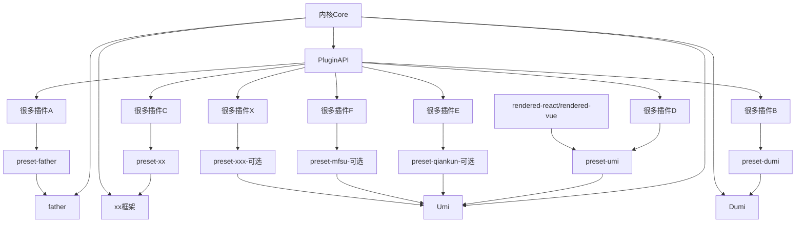
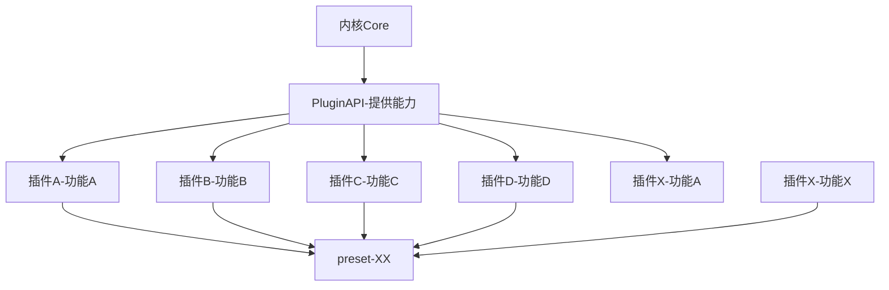
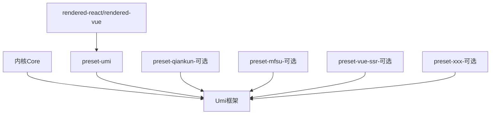
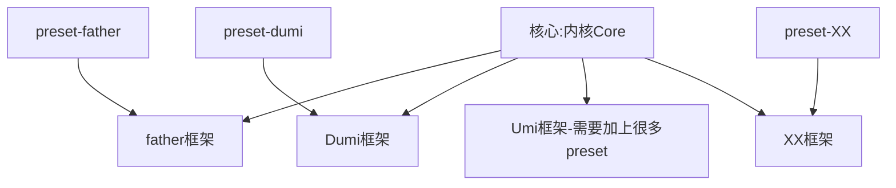

## 总览 Umi 微内核架构：



Core:

-   commands { cmd1:fn , cmd2:fn ...}
-   hooks { key1:fn[] , key2:fn[] ...}
-   应用元数据
-   prestes
-   plugins
-   ...

PluginAPI:

```ts
export default (api: IAPI) => {
api.registerCommand({
        key: '',
        fn(){}
    })
}

api.applyPlugins({
        key: '',
        initValue?: ''
    })
}
```

初始化阶段：按照一定的顺序依次获取所有 Prestes 和 Plugin
<br>

内核 Core 提供 PluginAPU--> 用户编写插件-->插件组合+内核 = 框架



插件 + 预设 = Umi 框架
<br>



<br>
不同插件 + 不同预设 = 不同框架


